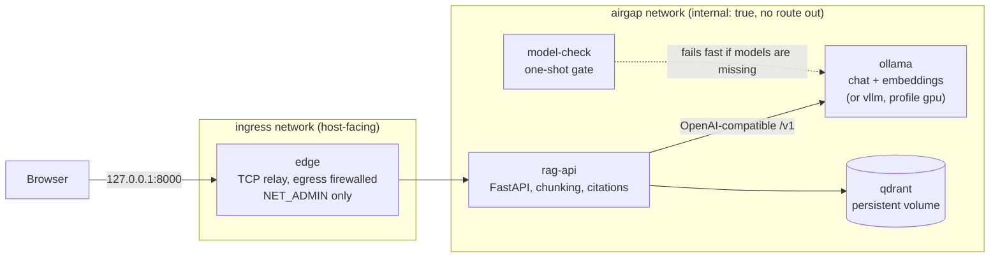

# offline-rag-stack

A self-hosted RAG system that runs with one `docker compose up` and never touches the internet at runtime. Local LLM (Ollama, or vLLM on NVIDIA), local embeddings, Qdrant, a FastAPI service with cited, streamed answers, and a small web UI. Every service sits on a Docker network with no route out, and a script proves it.

## What this demonstrates

- **Zero-egress network design:** every application service sits on an `internal: true` network, and the one container that publishes a port is a firewalled relay.
- **Automated air-gap verification:** a script probes DNS, TCP and HTTP from every container and fails if anything gets out.
- **Explicit failure handling:** LLM, embedding and Qdrant timeouts return 504, other upstream failures return 502, and streaming answers send an SSE error event.
- **Two real bugs found on the live stack:** a DNS leak and a logging crash, each fixed with a regression test.

## Why air-gapped deployment matters

Many of the organisations that most want document Q&A cannot send documents to a hosted API: hospitals and insurers bound by health-privacy rules, banks and defence suppliers with contractual data controls, government bodies with sovereignty requirements, and anyone whose documents are simply too sensitive to leave the building. For them the useful questions are different from a demo's: can it be installed from a USB drive, can you show that nothing leaves the host, and can IT audit what runs. This repo is a small, honest reference for that deployment shape. It is a portfolio project, not a hardened product; see [Limitations](#limitations).

## Architecture



| Service | Role |
|---|---|
| `ollama` | Serves the chat model and the embedding model over an OpenAI-compatible API |
| `qdrant` | Vector store with a named volume |
| `rag-api` | Ingest (PDF, DOCX, TXT, MD), boundary-aware chunking, retrieval, grounded answers with `[n]` citations, streaming `/query`, `/health`, `/info`, and the static UI |
| `model-check` | One-shot job that exits non-zero with a clear message if a required model is not in the volume. It never downloads anything |
| `edge` | A tiny TCP relay that publishes the UI port. See [Network design](#network-design) |
| `vllm` | Optional, compose profile `gpu`, for NVIDIA hosts |

The API talks to the LLM and the embedder only through the OpenAI-compatible client, so the backend is chosen by environment variables (`LLM_BASE_URL`, `LLM_MODEL`, `EMBED_BASE_URL`, `EMBED_MODEL`) and nothing else.

## Quickstart (online dev machine)

Needs Docker with Compose, and `uv` plus `make` if you want to run the checks locally. The default model is `llama3.2:3b` with `nomic-embed-text` for embeddings.

```bash
make pull-models   # one-time download into a Docker volume, the only step that needs internet
make up            # builds the images (needs internet the first time), then runs with no network
open http://127.0.0.1:8000
```

Upload a file from `eval/docs/`, then ask something about it. Or use the API:

```bash
curl -F files=@eval/docs/kestrel-datacenter-runbook.md localhost:8000/ingest
curl -N localhost:8000/query -H 'content-type: application/json' \
  -d '{"question": "When does the full database backup run?"}'
```

`/query` streams server-sent events: one `sources` event with the numbered citations (file and chunk), then `token` events, then either `done` or, if generation fails, a single `error` event. Send `"stream": false` for a single JSON response.

Useful targets: `make check` (ruff, mypy, pytest, none of which need models), `make logs`, `make down`, `make verify-airgap`, `make eval`.

Docker on macOS cannot pass the GPU through, so Ollama runs on CPU there. That is expected, and it is slow on small machines (see Limitations).

## Offline install

On an online machine with the same CPU architecture as the target:

```bash
make pull-models                 # if you have not already
scripts/bundle.sh                # writes dist/offline-rag-stack-<version>-<arch>.tar and a .sha256
```

The tarball contains the saved images (`docker save`), the Ollama model volume, the compose files, the installer, and a `SHA256SUMS` file covering every payload file. The relay image is included, and `bundle.sh` aborts if the `api` or `edge` image is missing from the set.

Carry the `.tar` and `.tar.sha256` to the offline machine (which needs Docker installed, and nothing else), then:

```bash
scripts/install-offline.sh offline-rag-stack-0.1.0-aarch64.tar ./offline-rag-stack
```

(The script is also inside the tarball if you only have the tarball.) It verifies the outer checksum and then `SHA256SUMS`, runs `docker load`, restores the model volume, and starts the stack with `--no-build --pull never`. It makes no network calls. Then run `./scripts/verify_airgap.sh` from the install directory.

The bundle path has not been run end to end on this project's hardware; see Limitations.

## Switching between Ollama and vLLM

Same API, different server, selected by environment only. For an NVIDIA host with the NVIDIA container toolkit:

```bash
cp .env.gpu.example .env.gpu
docker compose --profile gpu --env-file .env.gpu up -d
```

`.env.gpu` points `LLM_BASE_URL` at `http://vllm:8000/v1` and sets `LLM_MODEL` and `VLLM_MODEL`. Embeddings stay on Ollama (`nomic-embed-text`), so that model is still required. vLLM runs with `HF_HUB_OFFLINE=1` and reads weights from the `offline-rag-vllm-models` volume, which you populate yourself on an online machine (`bundle.sh --gpu` saves only the vLLM image, not weights). Back on a CPU host, drop the profile and the env file and you are on Ollama again, with no code change.

The compose file validates for both modes (CI checks this), but the vLLM path has never been run on real GPU hardware.

## Network design

The goal is that no container can reach the internet. Docker's `internal: true` network flag is the obvious tool, and it is necessary, but on its own it was not enough here. Two things were tested on Docker Desktop (macOS, Docker 29.1.3) before the design was settled.

**1. A published port does not work from an internal-only network.** A container on `internal: true` with `-p 18080:8000` is unreachable from the host:

```
A) published port on internal-only net:
000        <- curl got no HTTP response
```

So the browser cannot reach the API if the API lives only on the internal network.

**2. The usual workaround leaks.** A bridge network created with `enable_ip_masquerade=false` does serve the published port, but the container still reached the internet. A request to `1.1.1.1` came back with an HTTP 403 from the far end, which means the packet got out:

```
B) published port on no-masquerade net:
200
B egress:
urllib.error.HTTPError: HTTP Error 403: Forbidden   <- the request left the host
```

Docker Desktop does its own NAT inside its VM, so turning masquerade off changes nothing for egress.

**What the stack does instead.** All application services (`rag-api`, `ollama`, `qdrant`, `model-check`, `vllm`) are attached only to `offline-rag-airgap`, an `internal: true` network. A single extra container, `edge`, joins that network and a second host-facing one, and relays TCP from `127.0.0.1:8000` to the API. Because the relay has a route out in principle, it firewalls itself. Its entrypoint installs these rules before starting `socat`:

```
-P OUTPUT DROP
-A OUTPUT -d 127.0.0.11 -j DROP
-A OUTPUT -o lo -j ACCEPT
-A OUTPUT -m conntrack --ctstate RELATED,ESTABLISHED -j ACCEPT
-A OUTPUT -d 10.231.10.0/24 -j ACCEPT
```

That is: drop everything outbound except loopback, replies to inbound connections, and the internal subnet. The upstream is a fixed address (`10.231.10.10`), so the relay needs no name resolution. In isolation, with the same rules applied to a container on a normal bridge that does have internet, the firewall produced:

```
before firewall:
  reached 1.1.1.1
rules installed
after firewall:
wget: download timed out
  blocked
  tcp 443 blocked
  dns blocked
```

The only container with internet access is the dev-only `model-pull` helper (compose profile `online`), which exists to download models on an online machine and is never part of a normal `up`.

**Capabilities.** The relay runs with `cap_drop: [ALL]` and `cap_add: [NET_ADMIN]`, plus `no-new-privileges`, a read-only root filesystem, and tmpfs only for `/run` and `/tmp`. NET_ADMIN is needed to install the iptables rules and nothing else is. This was checked on the running container:

```
CapEff: 0000000000001000   <- bit 12, CAP_NET_ADMIN, and nothing else
CapBnd: 0000000000001000
```

The base image is pinned by digest (`alpine:3.21@sha256:ce64758a...`). The apk packages (`iptables`, `socat`) are fetched when the image is built on the online machine, and the built image is what gets bundled.

One honest limit: the relay process itself keeps NET_ADMIN, so a compromise of `socat` could rewrite the relay's own firewall. A stricter design would apply the rules from a separate sidecar that shares the network namespace and give the relay zero capabilities. That is not implemented.

### Proving it: `make verify-airgap`

`scripts/verify_airgap.sh` runs DNS, raw TCP and HTTP probes from a fresh container on the stack's network and from inside every running service, and it fails if any probe gets out. It also runs two controls so a broken probe cannot pass silently: the probe container must be able to reach the API over the internal network, and the same probe on the default bridge must reach the internet. Output from the running stack:

```
== probe container on offline-rag-airgap (outbound must fail)
  ok    fresh container        dns=blocked (gaierror) tcp=blocked (OSError) http=blocked (URLError)
== running services (outbound must fail)
  ok    rag-api                dns=blocked (gaierror) tcp=blocked (OSError) http=blocked (URLError)
  ok    ollama                 dns=blocked tcp=blocked
  ok    qdrant                 dns=blocked tcp=blocked
  ok    edge                   dns=blocked tcp=blocked http=blocked
== controls
  ok    probe container reaches rag-api:8000 over the internal network
  ok    same probe on the default bridge reaches the internet: dns=REACHED tcp=REACHED http=REACHED

AIR-GAP VERIFIED: no outbound connection succeeded from any probed container
```

The code is also checked statically: `tests/test_no_external_urls.py` fails the build if any runtime file mentions a URL whose host is not on a short internal allowlist (loopback and the compose service names). The web UI loads no CDN assets.

## Two bugs found by running it for real

Both were invisible to the unit tests and showed up only on the live stack.

1. **DNS leaked out of the relay.** The first `verify-airgap` run against the stack failed on `edge` with `dns=REACHED`, while TCP and HTTP were blocked. The relay is on a normal network, so Docker's embedded resolver at `127.0.0.11` forwarded its lookups to the host's DNS, and `getent hosts example.com` returned real addresses. `rag-api` could not do this, because the internal network's resolver does not forward. That is a data-exfiltration channel even with TCP closed. The isolated firewall test above had missed it because a plain bridge has no embedded resolver. Fix: the API gets a static IP, the relay uses it instead of a name, and the firewall drops all traffic to `127.0.0.11`. The re-run is the output shown above.
2. **Every ingest crashed at INFO log level.** The ingest log call passed `extra={"filename": ...}`, and `filename` is a reserved `LogRecord` attribute, so Python raised `KeyError: "Attempt to overwrite 'filename' in LogRecord"` and the endpoint returned 500. The unit tests missed it because they run at WARNING, where `logger.info` returns before building the record. Fix: the field is now `document`, and a regression test runs the app at INFO and checks the JSON log lines. It was confirmed to fail on the old code.

## Engineering notes

- Typed Python 3.12 with strict mypy, ruff, pydantic settings read from environment variables, and one-JSON-object-per-line logging.
- Chunking splits on paragraphs, then sentences, then words, packs to a size limit, and overlaps on sentence boundaries so chunks do not start mid-sentence.
- Every long-running service has a healthcheck, and `depends_on` uses health and `service_completed_successfully` conditions. Long-running services restart with `unless-stopped`.
- `/health` returns 503 and names the failing component (LLM, embeddings, or Qdrant). `/livez` is the container probe.
- **Upstream failures are explicit.** If the LLM, the embedding server or Qdrant times out, the API answers `504`; if they fail any other way (connection refused, an error status from the upstream), it answers `502`. Both carry a JSON body such as `{"error": {"type": "upstream_timeout", "component": "llm", "message": "...", "detail": "..."}}`, where `component` is `llm`, `embeddings` or `vector_store`. While streaming, the status line has already been sent, so the same payload arrives as an SSE `error` event and the stream ends without a `done`. Anything that is not a recognised upstream failure is still a plain `500` and is not disguised. The timeout is `LLM_TIMEOUT_S` (default 180 seconds) and applies to both the chat and embedding clients as a read timeout: for a non-streaming answer it is effectively the whole wait for the model, and for a streaming one it is the longest allowed gap between chunks.
- Unit tests mock the LLM, embedding and vector-store clients through plain protocols and an in-memory fake store, so the suite needs no models and no network. CI runs lint, type check and tests, validates the compose files, runs shellcheck, and downloads no models. It passes on GitHub Actions.

## Evaluation

`make eval` ingests three self-written sample documents (`eval/docs/`, about invented organisations, so a model cannot know the answers from training) and asks 10 questions (`eval/questions.json`). It reports:

- retrieval hit rate: the expected file is in the returned sources and a returned chunk contains the evidence phrase
- a crude answer keyword match and how often the answer carries a citation (not a correctness judgement)
- answer latency (mean, median, p95, max) and time to first token, with the first query reported separately as a warm-up

It writes `eval/results/latest.json`, including the hardware it ran on.

**No benchmark numbers are published here.** A clean run was not possible on the hardware this was built on (see below), and a run corrupted by memory pressure would not mean anything. The script is in the repo for anyone with a better machine. A guard test checks that every question's evidence phrase really exists in its document.

## Limitations

- **Tested on one 8 GB Apple M2,** with Docker Desktop capped at 5 GB; the host ran nearly out of memory.
- **`llama3.2:3b` was slow:** answers took 75.5 s, 119.9 s and 120.9 s, probably swap-affected. No other model (`qwen2.5` 3B or 1.5B) was tried or compared.
- **No benchmark numbers:** the only eval run returned a 500 after three answers, so no results file was written.
- **That 500 was never diagnosed** (the container logs were lost); the 180 s `LLM_TIMEOUT_S` is one candidate. Timeouts now return 504 and other upstream failures 502, tested with mocked clients only.
- **`bundle.sh` and `install-offline.sh` are untested end to end:** the ~9 GB Ollama image left too little disk (about 17 GB free), `bundle.sh` stages before it tars so it likely needs about twice the bundle size free (an estimate), and no separate offline machine was used.
- **The vLLM path has never run on a real GPU;** only the compose file and env switch were validated.
- **Air-gap checks are evidence, not proof:** DNS, TCP 443 and HTTP probes from five containers, on Docker Desktop for macOS only, not on Linux.
- **The relay keeps NET_ADMIN** (see [Network design](#network-design)).
- **No authentication or TLS,** no per-document permissions and no rate limiting; the port is bound to `127.0.0.1` only.
- **Single node:** no replication or high availability, and one Qdrant collection.
- **Text-only parsing and dense-only retrieval:** no OCR or table understanding, no reranking or hybrid search.
- **Partial image pinning:** only the relay's base image is pinned by digest; Python dependencies are locked in `uv.lock`.
- **Small local model:** answers can be wrong, and citations show which chunks were used without guaranteeing the answer is faithful to them.

## Repository layout

```
compose.yaml            services, internal network, profiles (gpu, online)
docker/                 api and edge Dockerfiles, relay firewall, model gate and pull scripts
src/rag_api/            the service (settings, chunking, parsing, clients, routes, static UI)
scripts/                verify_airgap.sh, bundle.sh, install-offline.sh, eval.py
eval/                   sample documents and the 10 questions
tests/                  unit tests with fakes, plus the no-external-URL test
.github/workflows/      CI: lint, types, tests, compose validation, shellcheck
```

## License

MIT
